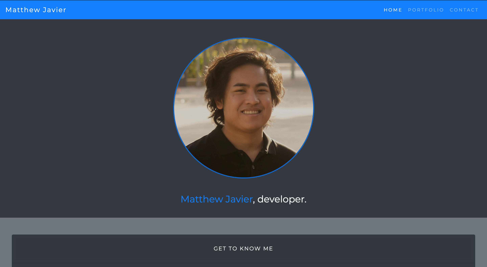
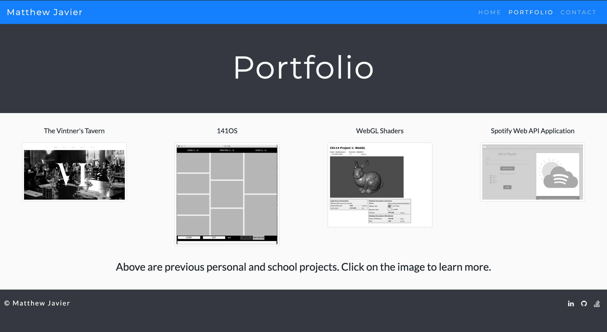

# mattjavier.github.io

A mobile responsive portfolio.

* files include `index.html`, `portfolio.html`, `contact.html`, `reset.css` and `style.css`, `style-portfolio.css`, `style-contact.css` and an images folder.

* The portfolio is developed mostly with Bootstrap, with additional styling in `style.css`, `style-portfolio.css` and `style-contact.css`. It includes:

  * a navbar

  * a responsive layout

  * responsive images

* Here is a screenshot of the homepage

* Here is a screenshot of the portfolio page

View the online portfolio here: https://mattjavier.github.io